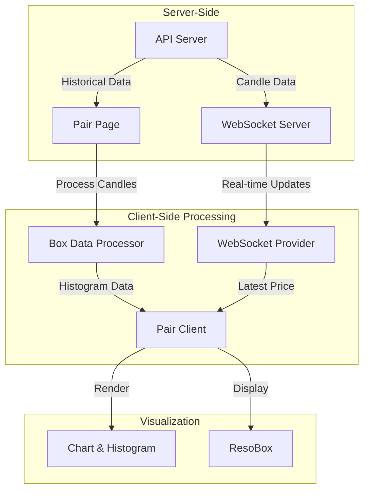
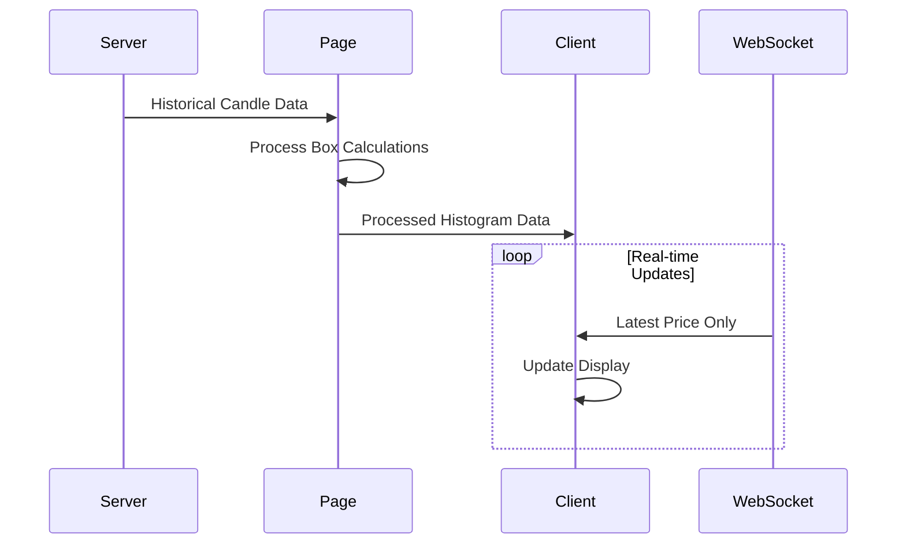

# Data Handling Pattern: Server, Page, and Real-time Integration

## Overview

This system implements a hybrid approach to data handling, combining:

1. Server-side historical box calculations
2. Page-level data processing for detailed views
3. Real-time WebSocket updates for live data



## Data Flow Patterns

### 1. WebSocket Provider (Real-time Updates)

```typescript
// Single timestamp, lightweight updates
interface PriceData {
    price: number;
    timestamp: string;
}

// WebSocket Provider fetches initial state
const fetchInitialCandleData = async () => {
    const response = await fetch(`${API_ROUTES.LATEST_CANDLES}`);
    const data = await response.json();
    // Transform and set single latest candle for each pair
};
```

### 2. Pair Page Processing (Historical Data)

```typescript
// Page.tsx - Fetches and processes historical data
async function fetchApiData(pair: string, token: string) {
    const CANDLE_LIMIT = 100;
    const response = await fetch(`${process.env.NEXT_PUBLIC_SERVER_URL}/candles/${pair}?limit=${CANDLE_LIMIT}`);
    // Process raw candle data
    return processedData;
}

// Process historical data into box calculations
const { histogramBoxes, histogramPreProcessed } = processInitialBoxData(rawCandleData, pair);
```

### 3. PairClient Component (Data Integration)

```typescript
const PairClient = ({ pair, chartData }: { pair: string; chartData: ChartData }) => {
    // Real-time data from WebSocket
    const { priceData } = useWebSocket();

    // Historical processed data
    const [histogramData, setHistogramData] = useState<ExtendedBoxSlice[]>(chartData.histogramBoxes);

    // Integration of both data sources
    useEffect(() => {
        if (chartData.processedCandles.length > 0) {
            setHistogramData(chartData.histogramBoxes);
        }
    }, [chartData]);
};
```

## Why This Pattern?

### Performance Optimization

1. **Reduced WebSocket Load**:

    - WebSocket only sends latest price updates
    - Prevents sending 30+ boxes × 1000s of timestamps (30,000+ data points)
    - Maintains real-time responsiveness

2. **Efficient Historical Data**:
    - Page-level processing for detailed views
    - One-time calculation of box data
    - Processed close to the data source

### Data Processing Location



## Implementation Details

### 1. Box Data Processing

```typescript
// boxDataProcessor.ts
export function processInitialBoxData(processedCandles: CandleData[], pair: string) {
    // Calculate boxes for each timestamp
    // Returns: { histogramBoxes, histogramPreProcessed }
}
```

### 2. Data Integration Points

#### Page Level (`page.tsx`):

```typescript
export default async function PairPage() {
    const rawCandleData = await fetchApiData(pair, token);
    const { histogramBoxes } = processInitialBoxData(rawCandleData, pair);

    return <PairClient chartData={{ histogramBoxes }} />;
}
```

#### Client Level (`client.tsx`):

```typescript
const PairClient = ({ chartData }) => {
    const { priceData } = useWebSocket(); // Real-time updates
    const [histogramData, setHistogramData] = useState(chartData.histogramBoxes);

    // Integrate historical and real-time data
};
```

## Benefits of This Approach

1. **Scalability**:

    - Handles large historical datasets efficiently
    - Minimizes WebSocket payload size
    - Supports multiple concurrent users

2. **User Experience**:

    - Immediate access to latest data via WebSocket
    - Rich historical data when needed
    - Smooth transitions between views

3. **Resource Optimization**:
    - Server resources focused on real-time updates
    - Client-side processing for detailed views
    - Efficient network utilization

## Connection with Real-time System

This pattern complements the real-time system documented in README.md:

1. **WebSocket Provider**:

    - Handles real-time price updates
    - Maintains lightweight connection
    - Focuses on immediate data needs

2. **Dashboard Provider**:

    - Manages box calculations for real-time updates
    - Integrates with historical data when available
    - Maintains state for active pairs

3. **PairResoBox**:
    - Visualizes both historical and real-time data
    - Seamlessly transitions between data sources
    - Maintains consistent user experience

## Usage Example

```typescript
// Combining historical and real-time data
const CombinedView = () => {
    const { histogramData } = usePairData();     // Historical
    const { currentPrice } = useWebSocket();     // Real-time

    return (
        <div>
            <HistogramView data={histogramData} />
            <CurrentPrice price={currentPrice} />
        </div>
    );
};
```

This hybrid approach ensures efficient data handling while maintaining real-time responsiveness, making it ideal for applications requiring both historical analysis and live updates.
