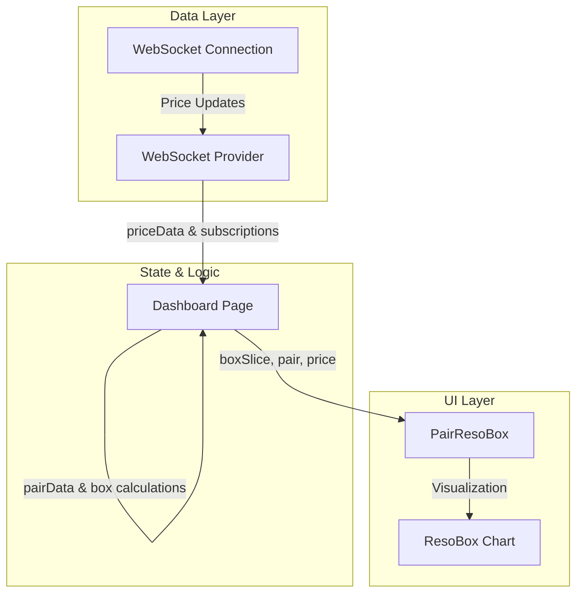
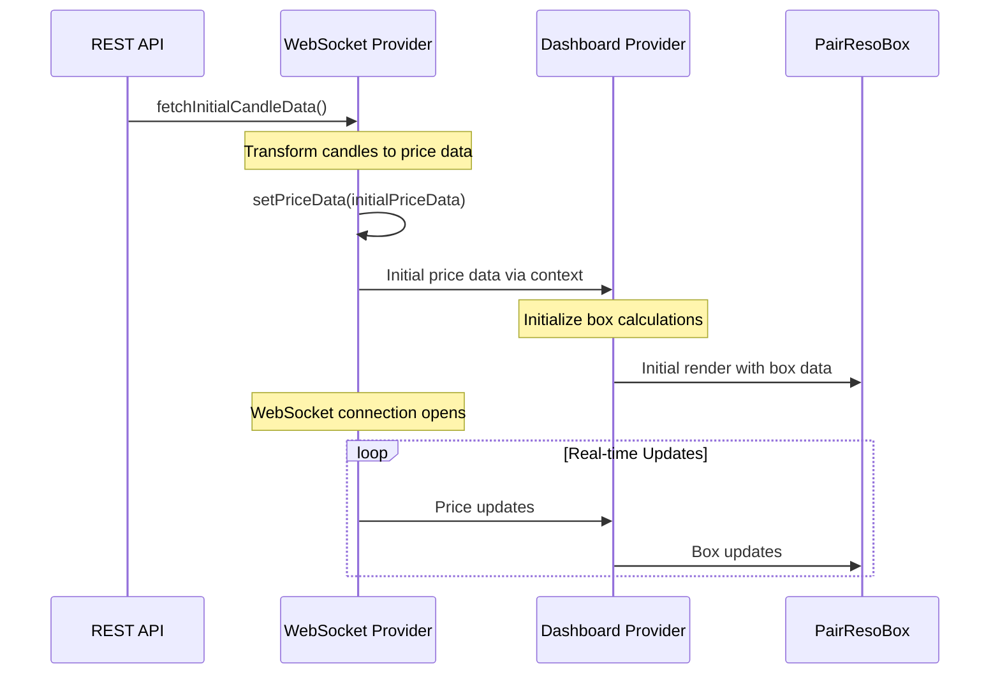

# Real-time Trading Dashboard System

## Component Architecture



## Core Components & Data Flow

### 1. WebSocket Provider (`providers/WebsocketProvider/index.tsx`)

```typescript
// Manages WebSocket connections and price data
const WebSocketProvider = ({ children }) => {
    const [priceData, setPriceData] = useState<Record<string, PriceData>>({});
    const [isConnected, setIsConnected] = useState(false);

    // Critical: Initial candle data fetching
    const fetchInitialCandleData = useCallback(async () => {
        if (!session?.access_token) return;

        try {
            // Fetch latest candles from API
            const response = await fetch(`${window.location.origin}${API_ROUTES.LATEST_CANDLES}?token=${session.access_token}`);

            const data = await response.json();
            const initialPriceData: Record<string, PriceData> = {};

            // Transform candles to price data for each pair
            Object.entries(data).forEach(([pair, candle]: [string, any]) => {
                const priceData = transformCandleToPrice(pair, candle);
                if (priceData) {
                    initialPriceData[pair] = priceData;
                }
            });

            // Set initial price state
            if (Object.keys(initialPriceData).length > 0) {
                setPriceData(initialPriceData);
            }
        } catch (error) {
            console.error('Failed to fetch initial candle data:', error);
        }
    }, [session?.access_token]);

    // Exposes methods for subscription management
    const subscribeToBoxSlices = (pair: string, callback: Function) => {
        // Handle subscription logic
    };

    return (
        <WebSocketContext.Provider value={{
            priceData,
            isConnected,
            subscribeToBoxSlices,
            unsubscribeFromBoxSlices
        }}>
            {children}
        </WebSocketContext.Provider>
    );
};
```

### 2. Dashboard Provider (`providers/DashboardProvider/client.tsx`)

```typescript
// Manages box calculations and pair data
const DashboardProvider = ({ children }) => {
    const [pairData, setPairData] = useState<Record<string, PairData>>({});
    const boxMapRef = useRef<Map<string, Box[]>>(new Map());
    const { priceData, subscribeToBoxSlices } = useWebSocket();

    // Handles real-time price updates and box calculations
    useEffect(() => {
        if (!priceData) return;

        // Process price updates and update boxes
        // Update pairData state when boxes change
    }, [priceData]);

    return (
        <DashboardContext.Provider value={{
            pairData,
            isLoading,
            isConnected
        }}>
            {children}
        </DashboardContext.Provider>
    );
};
```

### 3. Dashboard Page (`app/(user)/dashboard/page.tsx`)

```typescript
// Main dashboard component
export default function DashboardPage() {
    return <DashboardClient />;
}

// Client component with real-time updates
const DashboardClient = () => {
    const { pairData } = useDashboard();

    return (
        {Object.entries(pairData).map(([pair, data]) => (
            <div key={pair} data-pair={pair}>
                <PairResoBox
                    pair={pair}
                    boxSlice={data.boxes[0]}
                    isLoading={isLoading}
                />
            </div>
        ))}
    );
};
```

### 4. PairResoBox Component (`app/(user)/dashboard/PairResoBox.tsx`)

```typescript
interface PairResoBoxProps {
    pair?: string;
    boxSlice?: BoxSlice;
    boxColors?: BoxColors;
    isLoading?: boolean;
}

export const PairResoBox = ({ pair, boxSlice, isLoading }) => {
    const { priceData } = useWebSocket();
    const currentPrice = pair ? priceData[pair]?.price : null;

    return (
        <div className="...">
            {/* Price Display */}
            <div>{pair?.toUpperCase()}</div>
            <div>{currentPrice}</div>

            {/* Box Visualization */}
            <ResoBox
                slice={boxSlice}
                pair={pair}
                showPriceLines={settings.showPriceLines}
            />
        </div>
    );
};
```

## Data Flow Process

1. **Initial Data Loading**:

    - WebSocket provider fetches initial candle data on mount
    - Candles are transformed into price data for each pair
    - Initial price state is set before WebSocket connection
    - This ensures components have data to display immediately

2. **WebSocket Price Updates**:

    - WebSocket provider receives real-time price updates
    - Updates are stored in `priceData` state
    - Components subscribed to specific pairs receive updates

3. **Box Data Management**:

    - Dashboard Provider maintains box state in `boxMapRef`
    - Processes price updates to calculate box changes
    - Updates `pairData` state when boxes change

4. **UI Updates**:
    - Dashboard page renders PairResoBox components for each pair
    - PairResoBox receives:
        - Current box data via `boxSlice` prop
        - Real-time price updates via WebSocket context
        - Loading states and settings

## Data Initialization Flow



## Key Features

1. **Real-time Updates**:

    - WebSocket connection for live price data
    - Efficient box calculations
    - Smooth UI updates

2. **State Management**:

    - Centralized WebSocket state
    - Box calculations in Dashboard Provider
    - Component-specific settings

3. **Performance**:
    - Reference-based updates
    - Minimal re-renders
    - Efficient data flow

## Component Responsibilities

### WebSocket Provider:

- Manages WebSocket connection
- Handles price data updates
- Provides subscription methods

### Dashboard Provider:

- Processes price updates
- Calculates box changes
- Manages pair data state

### Dashboard Page:

- Renders pair components
- Handles layout and organization
- Manages global settings

### PairResoBox:

- Displays current price
- Visualizes box data
- Handles pair-specific settings

This architecture ensures:

- Clean separation of concerns
- Efficient data flow
- Scalable component structure
- Optimized performance
- Real-time responsiveness
